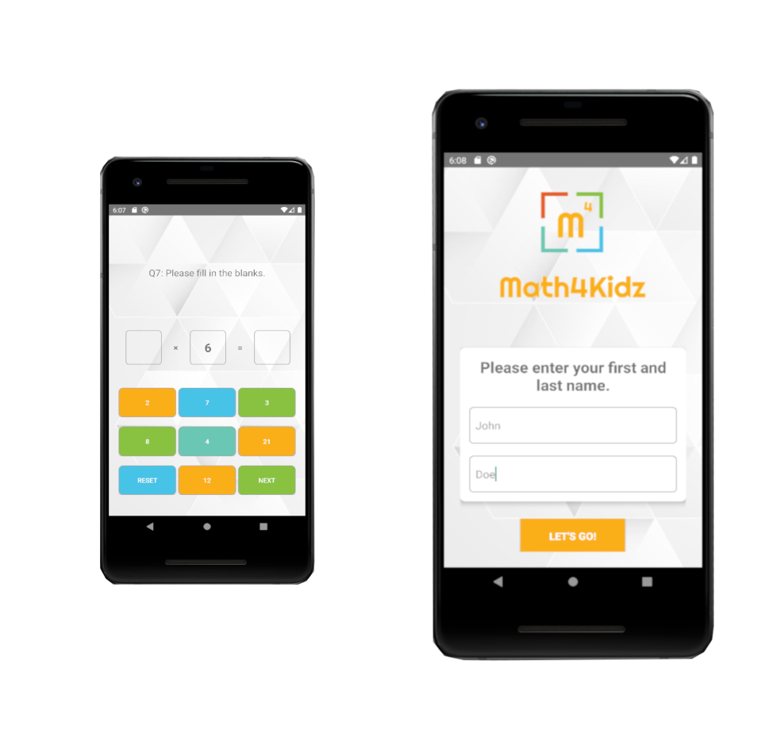

# Math4Kidz
 A mathematics quiz application for primary school children. 

User is prompted to enter their details. If valid, they will be asked a series of 12 basic math questions randomly
selected from a larger pool of questions.
